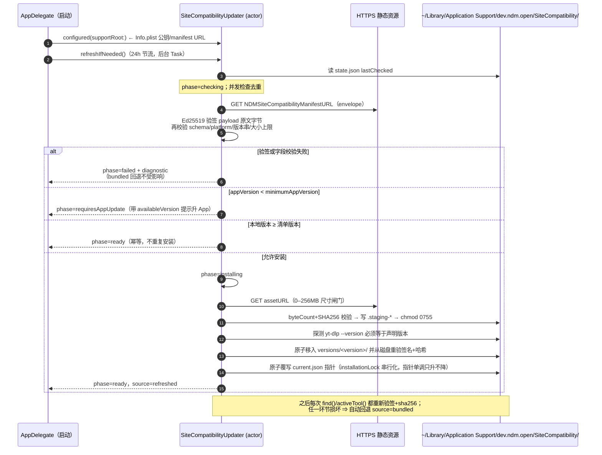

# NDM 站点可靠性备忘录（签名兼容性更新管线）

> 状态：**现状文档 + 运维手册，待补齐项见文末清单**。本文描述已落地的代码行为，不引入新设计。
> 依据：`SiteCompatibilityUpdater.swift`、`YtDlpTool.swift`、`BridgeProtocol.swift`、`extension/NDMRelay/site-adapters.js` / `media-policy.js`、`Scripts/sign-site-compatibility-manifest.swift`。
> 行号基于 `/Users/gaoyuan/NDM` 仓库（2026-08-23 核对）。
> 撰写：2026-08-23

## 结论（一句话）

**站点"今天还能用吗"是本品类付费转化的第一杠杆**：竞品最大痛点就是"站点一改版就集体失效、修复要等下个版本"——我们已经用 Ed25519 签名清单把 yt-dlp 兼容性修复做成**当天可下发、无需发版**的能力，这是续传加速之外最值得写进商品页的信任资产。

---

## 1. 可靠性与付费转化的关系

`MONETIZATION.md` 已定调：价格不是第一推动力，可靠性才是——"先把 YouTube/B站今天还能用吗做成信任资产（失效快速修复 + 透明状态），这是全品类最大痛点"。本文是该结论的工程落地侧：

| 商业化诉求 | 对应机制 | 落点 |
|---|---|---|
| 失效快速修复（不等 App Store 审核） | 签名清单热更 yt-dlp 二进制 | §2 |
| 用户敢信"修好了就是真修好了" | 私钥离线 + 公钥内嵌 + 双重哈希校验 | §3 |
| 出问题时有话可说（透明状态） | phase 状态机 + diagnostic 字段可进设置页 | §2 / §6 |
| 视频能力无法上 MAS 的店外分发叙事 | 与 Downie 同款"独立更新通道"故事 | `MONETIZATION.md` 工程项 4 |

## 2. 现有架构：签名清单更新管线

### 2.1 参与者与信任根

- **manifest URL 与公钥来自 Info.plist**：`SiteCompatibilityConfiguration.fromBundle()` 读取 `NDMSiteCompatibilityManifestURL`（强制 `https`）与 `NDMSiteCompatibilityPublicKey`（base64、恰好 32 字节），任一缺失则整个更新器不初始化（`Sources/NDMEngine/SiteCompatibilityUpdater.swift:16-26`）。打包时由 `Scripts/package-app.sh:119-137` 用 `plutil` 注入，环境变量为 `NDM_SITE_COMPATIBILITY_MANIFEST_URL` / `NDM_SITE_COMPATIBILITY_PUBLIC_KEY`；两者只给其一或声明了 `NDM_REQUIRE_SITE_COMPATIBILITY_UPDATES=1` 却缺失都会打包失败。
- **Ed25519 envelope**：清单文件是一个 `{payload, signature}` 信封（`:66-74`）。`payload` 是单独编码的 JSON 原文字节（排序键），签名直接对这些字节做 `Curve25519.Signing` 校验——**验签先于解码**，不依赖 JSON 键序或空白（`verify()` `:452-467`）。
- **payload 字段即安全锚**：`schemaVersion(=1) / version / publishedAt / minimumAppVersion / platform(=macos-universal) / assetURL / sha256 / byteCount`（`:35-64`）。字段合法性在验签后强校验：版本串必须匹配 `^[A-Za-z0-9][A-Za-z0-9._-]{0,63}$`、`byteCount ∈ (0, 256MB]`、`sha256` 必须是 64 位十六进制、`assetURL` 必须 https 且无 userinfo（`:474-491`）；下载器另有 0–256MB 的尺寸闸门（`:164-176`）。
- **sha256 锚定**：下载完成后按 `byteCount` 与小写 hex `sha256` 双重比对（`install()` `:516-522`）；写入磁盘后、翻转指针前**从磁盘再验一次**签名与哈希（`:553-558`）。此后每次解析活动版本都重验签名+哈希+可执行位+`--version` 自报版本（`activeTool()` `:407-450`），结果按"文件身份+公钥"缓存（`:380-400`）。

### 2.2 更新时序

启动时 `AppDelegate.swift:99-102` 创建 updater 并后台调 `refreshIfNeeded()`（24 小时节流，状态存 `state.json` 原子写，`SiteCompatibilityUpdater.swift:207-213, 349-361`）；设置页手动检查直达 `checkAndInstall()`（`SettingsWindowController.swift:1298`）。并发检查按 id 去重合并（`:216-232`）；actor 在每次网络挂起点后从磁盘重读状态，避免共享 supportRoot 的两个实例互相误判（`:250-257, 280-284` 注释明示）。



### 2.3 phase 状态机与来源回退

- **phase**：`ready / checking / installing / requiresAppUpdate / failed`（`:81-87`）。每条终态路径统一经 `complete()` 持久化 `lastChecked` 再发布快照，防止分支漂移（`:310-318`）；失败快照携带 `diagnostic`（`:294-305`）。
- **source**：`refreshed` vs `bundled`（`:76-79`）。`resolvedSnapshot()` 先问磁盘上有没有通过全部验证的 `current.json → versions/<v>/` 安装；有则 `refreshed`，否则回退 App bundle 内置的 `yt-dlp`（`:320-338`）。**坏安装永远不会顶替回退**——staging 目录原子移动、指针翻转前重验（`:528-563`）。
- **运行期选择顺序**：`YtDlpTool.find()` 先取 refreshed 版本，再找 bundle 内置工具，最后仅 DEBUG 才允许 PATH/homebrew 兜底；Release 缺内置工具链视为打包事故直接返回 nil（`Sources/NDMEngine/YtDlpTool.swift:263-297`，注释："A release missing its private toolchain is a broken package"）。配套加固：`warm()` 后台预付 Gatekeeper 首扫（避免首探卡约 25s，`:301-306`）；插件目录锁死为签名包内 `yt-dlp-plugins`（`--no-plugin-dirs`，`:308-324`）；TLS 走系统 CA 桥而非 certifi（`:342-345`）。

## 3. 威胁模型简表

| 威胁 | 场景 | 缓解 | 残余风险 |
|---|---|---|---|
| 伪造清单 | 攻击者向 CDN 投放自签/篡改清单诱导执行任意二进制 | Ed25519 私钥永不进包（`SiteCompatibilityUpdater.swift:6` 注释）；公钥内嵌 Info.plist 且 32 字节硬校验（`:20-22`）；**先验签后解码**，任何字段在签名前不可信（`verify()` `:452-467`）；签名脚本独立镜像同一结构并交叉探测二进制自报版本（sign 脚本 `:6-9, 53-71`） | 私钥一旦泄露即全线沦陷：目前单公钥、无撤销/轮换机制（§6） |
| 降级攻击 | 重放一份旧的合法清单让用户装回有漏洞的旧 yt-dlp | 安装前比较本地版本，≥ 清单版本直接幂等返回（`:253-257`）；`install()` 在锁内再次保证指针单调，慢速旧下载不可能回滚新装版本（`:509-514`）；`safeVersion` 正则防路径注入（`:597-604`） | 全新机器首次检查可收到"合法但陈旧"的版本：客户端未校验 `publishedAt` 时效（§6） |
| CDN 篡改 | 存储层/中间盒替换 asset 二进制 | `sha256` + `byteCount` 锚定在被签名的 payload 内，下载即校验（`:516-522`）；激活前从磁盘二次重验（`:553-558`）；此后每次读取仍重验（`:442-443`）；`assetURL` 强制 https、禁 userinfo（`:486-491`） | 无证书固定，依赖系统 TLS；恶意本地 CA 场景由 macOS Keychain 信任决定 |
| 重放（同版本） | 重发完全相同的清单+资产 | 结果幂等：字节相同（sha256 钉死）、安装被版本比较跳过（`:253-257`），无害 | 无 |

另两条非攻击面的健壮性事实：多 updater 共享 supportRoot 时提交被 `installationLock` 串行化、actor 在每个挂起点后重读磁盘（`:250-257, 506-514`）；解析缓存键包含文件 mtime/size + 公钥指纹，外部改动即刻失效（`:425-433, 606-610`）。

## 4. 运维手册：发布一次 yt-dlp 兼容性更新

前提：持有 `NDM_SITE_COMPATIBILITY_PRIVATE_KEY`（base64 的 Ed25519 raw representation，离线保管）。

1. **取件与预检**

   ```bash
   # 官方 universal 构建，确认自报版本与目标一致（脚本也会再查一遍）
   ./yt-dlp_macos --version            # 例：2026.08.28
   shasum -a 256 yt-dlp_macos          # 记下小写 hex，稍后比对
   stat -f %z yt-dlp_macos             # byteCount
   ```

2. **签名清单**（`Scripts/sign-site-compatibility-manifest.swift:32-34` 用法：`<binary> <version> <minimum-app-version> <https-asset-url> <output-json>`）

   ```bash
   export NDM_SITE_COMPATIBILITY_PRIVATE_KEY="$(op read op://vault/ndm-sitecompat/key)"  # 或等效离线通道
   swift Scripts/sign-site-compatibility-manifest.swift \
     ./yt-dlp_macos \
     2026.08.28 \                        # 必须等于二进制 --version 输出，否则脚本报错退出（:69-71）
     1.2.0 \                             # minimumAppVersion：低于此 App 版本将收到 requiresAppUpdate
     "https://cdn.example.com/ndm/site-compat/2026.08.28/yt-dlp_macos" \
     ./manifest.json
   # 脚本会打印本次公钥 —— 与打包进 Info.plist 的值逐字核对
   ```

3. **上传 asset 并做远端一致性校验**

   ```bash
   curl -f -X PUT --upload-file ./yt-dlp_macos \
     "https://cdn.example.com/ndm/site-compat/2026.08.28/yt-dlp_macos"
   curl -fsSL "https://cdn.example.com/ndm/site-compat/2026.08.28/yt-dlp_macos" | shasum -a 256
   # ↑ 必须与第 1 步本地值一致
   ```

4. **发布 manifest 到固定 URL**（Info.plist 里那个地址；注意 CDN 缓存 TTL，必要时先 purge）

   ```bash
   curl -f -X PUT --upload-file ./manifest.json "$NDM_SITE_COMPATIBILITY_MANIFEST_URL"
   ```

5. **发布前校验清单内容与签名**（payload 是 base64(sortedKeys JSON)，可直接人审）

   ```bash
   jq -r .payload manifest.json | base64 -d | jq .
   jq -r .payload manifest.json | base64 -d | jq -r .sha256   # == shasum 值

   # Ed25519 离线验签，逻辑同 SiteCompatibilityToolStore.verify()（SiteCompatibilityUpdater.swift:452-467）
   PUB="$NDM_SITE_COMPATIBILITY_PUBLIC_KEY" swift - <<'EOF'
   import CryptoKit
   import Foundation
   let a = CommandLine.arguments[1]
   let env = try! JSONDecoder().decode([String:String].self, from: Data(contentsOf: URL(fileURLWithPath: a)))
   let payload = Data(base64Encoded: env["payload"]!)!
   let sig = Data(base64Encoded: env["signature"]!)!
   let key = try! Curve25519.Signing.PublicKey(rawRepresentation: Data(base64Encoded: ProcessInfo.processInfo.environment["PUB"]!)!)
   print(key.isValidSignature(sig, for: payload) ? "signature OK" : "signature INVALID")
   EOF
   ```

6. **端到端冒烟**：用第 2 步的公钥走 `package-app.sh` 打一个 QA 包，启动 App 触发 `refreshIfNeeded()`，确认：
   - 设置页手动检查后 phase 变 `ready`、`source=refreshed`；
   - `~/Library/Application Support/dev.ndm.open/SiteCompatibility/current.json` 指向新版本（`DownloadStore.swift:23-27`、`SiteCompatibilityUpdater.swift:403-405`）；
   - 故意改坏远端 sha256 一位，确认 phase=`failed` 且下载仍走 bundled 回退。

7. **记录**：在发布台账登记 version / publishedAt / minimumAppVersion / asset URL / sha256，供回滚审计。

## 5. 扩展侧未来工作：数据驱动热更 vs 随扩展发版

Relay 扩展没有 yt-dlp 那样的独立二进制通道，Chrome Web Store 明令禁止**远程托管代码**（远程拉取并在扩展内执行的 script/eval/wasm 一律不允许，MV3 CSP 也封死了远程脚本）；远程配置只能以**纯数据**形式存在，由已随包发布的解释逻辑消费。据此把 `site-adapters.js` / `media-policy.js` 的内容分两类：

**适合未来做成签名数据热更（消费代码已在包内）：**
- 站点名册与 host 归属表：`siteForURL` 里硬编码的 x/youtube/bilibili/vimeo/instagram/tiktok/douyin 判定（`extension/NDMRelay/site-adapters.js:13-24`）；
- 各站 canonical URL 的 pathname 正则（如 Bilibili `/video/(BV…|av\d+)`、TikTok `/@user/video/\d+`，`site-adapters.js:26-94`）；
- 注入目标选择器字符串：YouTube `ytd-watch-metadata #top-level-buttons-computed`（`:476`）、Bilibili `#arc_toolbar_report … .video-tool-more` 家族（`:498-506`）、X 的 `article[data-testid="tweet"]` + `[role="group"]`（`:444-451`）；
- media-policy 的静态表：视频/音频扩展名白名单、易变查询参数表（token/signature/expires/x-amz-* 等）（`extension/NDMRelay/media-policy.js:8-12`）。
  共同点：都是**字符串/正则常量**，换值不改变控制流。若落地，建议复用 §2 同一套 Ed25519 envelope + sha256 基建，schema 加 `minimumExtensionVersion`。

**必须随扩展发版（本质是代码逻辑）：**
- 挂载与时序策略：Bilibili 等 SPA 的 hydration 等待、MutationObserver 只盯 toolbar 不盯 documentElement（`site-adapters.js:292-363`）；
- 布局适配算法：`crowdingScore` / `fitChipMode` 让位阶梯（`:244-279, 544-553`）；
- 打分与判定函数：`candidateScore` / `semanticKey` / `compactCandidates` / `shouldInterceptNavigation`（`media-policy.js:131-173, 210-228`）。
  这些若允许远程下发就等于远程代码，违反 CWS 政策；正则本身也需谨慎——数据里出现可拼接出新行为的表达式应视同代码处理，解释器必须限制为"匹配/替换"原语。

## 6. 未完成项 / 待办清单

- [ ] **密钥运维**：私钥托管流程成文（当前仅环境变量约定，sign 脚本 `:44-48`）；公钥轮换与吊销方案（现架构单信任根，泄露无解）。
- [ ] **新鲜度防线**：`publishedAt` 已被签名但客户端未校验时效，全新装机可能拿到"合法但陈旧"版本——加最大年龄阈值或清单多版本列表。
- [ ] **透明状态 UI**：`SiteCompatibilitySnapshot` 已含 phase/version/source/diagnostic（`:89-112`），设置页尚未完整展示（现仅有手动触发检查，`SettingsWindowController.swift:1298`）。
- [ ] **回滚策略**：`versions/` 目录会累积历史版本，无清理与主动降级流程。
- [ ] **遥测**：failed/requiresAppUpdate 比例与 diagnostic 匿名聚合（无账号前提下），支撑"失效→修复"时长这一商业化指标。
- [ ] **CDN 策略**：manifest 固定 URL 的缓存 TTL / purge 流程未固化进 §4 手册。
- [ ] **Windows 对应管线**：`platform` 目前硬编码 `macos-universal`（`:50`），docs/WINDOWS.md 的 Windows 版需要平行设计。
- [ ] **扩展数据热更**：§5 的选择器/host/正则表抽取 + 签名 schema 设计（复用 §2 基建）尚未开工。
