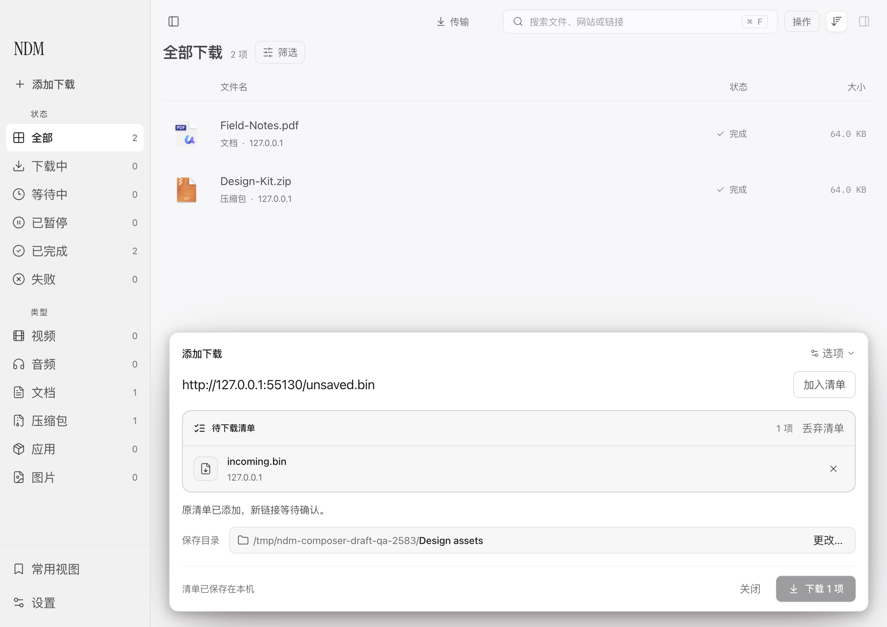
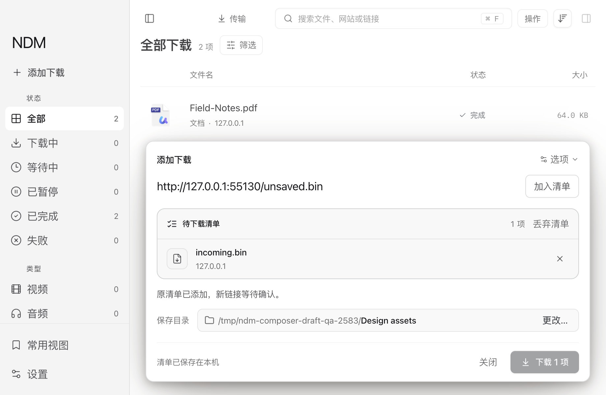

# 添加下载：可恢复清单与创建收据

2026 年 9 月 12 日。本轮实现与验收记录，接续[前期审查](2026-09-12-composer-draft-audit.md)。已交付于[构建 2026091205](../releases/2026.9.12-build.2026091205.md)。

## 用户得到什么

准备一批下载时，用户可以先粘贴链接、移除不需要的项目、选择保存位置，再关闭窗口。下次点“添加下载”，原清单与尚未加入的输入仍在。正常退出后重开也能继续，不必重新整理一遍。

一批里已经成功创建的项目归下载列表管理，失败和未开始的项目留在清单中。如果引擎已经创建了任务，但界面没有收到回执，恢复后先确认创建结果；不会把“没收到回复”直接当作“没有创建”，再添加一次。

这是对现有添加窗口的完善。没有新增“草稿中心”、侧栏栏目、启动弹窗或自动下载步骤。

## 交互取舍

| 场景 | 当前行为 | 设计理由 |
| --- | --- | --- |
| 手动准备清单后关闭 | 保存列表、输入、显式目录和连接数；按钮显示“关闭” | 关闭工作窗口不等于丢弃工作 |
| 重新打开或应用重启 | 用户打开添加窗口后恢复；跳过自动剪贴板预填 | 原来的工作优先，恢复不代替用户确认 |
| 只是自动读到剪贴板 | 未经编辑的自动预填不建立持久清单 | 不把一次路过的链接悄悄变成长期记录 |
| 输入尚未加入清单 | 输入与已确认项目分开；先“加入清单”，再确认下载 | 避免用户以为新输入已经包含在批量提交里 |
| 浏览器又传入新链接 | 保留原清单与输入；提交或关闭处理中先暂存，结束后呈现供确认 | 新入口不覆盖旧工作，也不在用户未检查时开始下载 |
| 部分成功或停止添加 | 已创建项移出待添加列表，其余继续保留 | “继续”只处理尚需处理的项目 |
| 回执不确定 | 显示待确认数量，操作为“确认 N 项”；确认前不能移除该项 | 先弄清事实，避免用户通过重试或删除掩盖未完成的提交 |
| 全部确认成功或明确丢弃 | 清空当前清单；下一批使用新的标识 | 同一链接以后仍能有意再下载，不建立全库 URL 黑名单 |
| 保存失败 | 保留可编辑内容和短错误说明，阻止会丢失编辑的关闭或退出；允许重试 | 只有收到持久化确认后才承诺“已保存在本机” |

普通编辑以 200 毫秒合并保存，界面区分“正在保存”与“已保存”。提交、关闭和退出使用明确的保存确认，不依赖编辑延迟碰巧结束。恢复后的提示留在原窗口内，不增加常驻导航或额外管理层级。

## 实现中需要守住的约定

### 一份工作位置，两个不同的保存对象

[Composer](../../src/renderer/src/components/Composer.tsx) 保留批量清单及尚未加入的输入；[ComposerDraftSession](../../src/renderer/src/lib/composerDraftSession.ts) 串行处理保存回执，使用已确认的版本号，丢弃后的迟到保存不能复活旧清单。

[主进程草稿控制器](../../src/main/composerDraft.ts) 将白名单内容通过 Electron 系统安全存储加密，写入应用数据目录内独立的 `composer-draft.enc`。目录支持隔离 QA 配置。保存采用临时文件、同步落盘和原子替换；加密不可用、解锁失败、损坏或不支持的版本都保留原记录，不降级为明文，也不覆盖为空清单。

目录与连接数各自记录“沿用默认”或“用户明确指定”。已准备发送的请求则固定当时的准确参数，重试不会偷偷换目录、连接数或媒体格式。

### 先记录创建意图，再发送请求

批量项目在调用 `add` 或 `addMedia` 前，先保存稳定的 `creationKey`、固定请求及“待确认”状态。收到任务 ID 后再保存确认结果。解析阶段尚未发出创建请求，不能伪装成已经创建。

macOS 在任务数据库事务内同时写入任务与独立的创建收据；Windows 在同一次原子状态替换中写入任务与收据。相同键、相同意图返回原任务，不重复启动；不同意图拒绝。任务被删除后收据仍保留，因此恢复不会把已删除任务重新建立起来。媒体仍在准备时，查询返回 `pending`，不能被解释为“未创建”。

[创建调用与重播](../../src/renderer/src/lib/store.ts) 区分解析失败和创建失败：媒体创建请求一旦开始，就不能因为报错再退回普通文件下载。重播已保存请求不会重新分类 URL 或挑选新的媒体格式。无效、不支持或身份不匹配的收据也不能授权重试。

### 退出必须等到保存确认

[退出握手](../../src/main/composerDraftQuit.ts) 向实际主窗口请求刷新编辑，核对发送者与本次令牌，收到成功回执后再排空主进程写入并退出。超时或保存失败不等于成功。没有存活主窗口时，只完成已经收到的写入，不凭空恢复或提交下载。

本轮还修复了几个容易被正常流程掩盖的边界：读取失败后重试真正回填界面，并保留失败期间的新编辑；“查看已有”经过相同保存边界；完成一批后下一批不会复用已丢弃的标识；最终清理回执等待期间抵达的新链接进入新清单。

## 已验证的证据与范围

验证全部使用合成链接、测试剪贴板、隔离数据目录及本地服务。以下临时目录是本机验收产物，不是随仓库分发的资产。

| 验证层 | 已确认的结果 | 证据与限制 |
| --- | --- | --- |
| **真实 macOS Electron + Swift Host** | 正常重启恢复、读取失败重试、创建后回执前重载 renderer、提交中接收新链接、保存失败阻止关闭与退出、同一 renderer 连续两批、最终清理等待期间接收新链接均通过。最终 **7 个实际下载文件**逐字节等于预期内容、7 个不同 URL 各对应一个任务，最终清单为空；无 renderer 错误 | [QA 脚本](../../scripts/qa-composer-draft.mjs)，本机 `/tmp/ndm-composer-draft-qa-91330/result.json`。下载和 Host 为真实实现；剪贴板、选目录及指定的 IPC 延迟/失败注入受控。报告中的一个中间检查仍写“three artifacts”，脚本末尾另有全部 7 文件的字节与唯一性断言 |
| **真实 Electron 批量交互回归** | 粘贴需确认、去重与移除、部分失败、停止后继续、关闭重开、已成功项不重试、显式目录、自动剪贴板不持久化、Escape 不关闭未完成请求，以及侧栏/详情状态恢复均通过 | [QA 脚本](../../scripts/qa-composer-batch-review.mjs)，本机 `/tmp/ndm-composer-batch-review-5FTzDJ/result.json`。使用真实加密草稿 IPC，但创建收据为合成响应，**这组没有实际下载** |
| **原生定点回归** | 共 107 项定点测试，0 失败；其中 4 项外网 YouTube 集成测试按默认开关跳过 | 本机 `/tmp/ndm-creation-tests-final.log`。覆盖创建收据事务、并发协调、任务管理及相关媒体/Relay 回归；不是全量原生套件的完成声明 |
| **独立真实 Host 流程** | 7 个场景通过：普通回执丢失与 10 个并发重试、重启/意图冲突/删除墓碑、启动报错后保留任务、媒体准备 pending/回执丢失/并发/重启、媒体删除与意图变更、准备阶段终止进程后恢复、准备失败与非法请求拒绝 | 本机 `/tmp/ndm-creation-host-qa.log`。真实 Host、临时数据库与本地下载；媒体外部工具以受控夹具验证准备和回执边界，不代表外部视频网站可用性 |
| **Windows 引擎逻辑** | 45 项测试通过，其中 19 项新增创建收据测试：并发、重建引擎、删除、原子替换失败、后续状态写失败、退出与迟到媒体准备等 | [收据测试](../../tests/windowsCreationReceipts.test.mjs)，本机 `/tmp/ndm-windows-creation-receipts-tests.log`。**本机 Node 运行 Windows 引擎类，使用真实临时状态文件与模拟 aria RPC；没有运行真实 Windows 安装包或 aria2.exe** |
| **renderer 创建保护** | 14 项新增测试与 10 项既有路由测试通过；保存确认前不发创建、保存失败不发创建、媒体创建失败不退回普通 `add`、固定请求重播、收据 absent/pending/删除/损坏均覆盖 | [创建保护测试](../../tests/composerCreationSafety.test.mjs)，本机 `/tmp/ndm-composer-creation-safety-tests.log`。使用受控 IPC，不代替前面的真实 Host 验证 |

加密控制器、编辑会话和退出握手另有针对性测试，涵盖读写失败、异步加密、损坏/未来版本保留、过期版本冲突、未确认写入排空、错误窗口/令牌及退出超时。对应 [草稿控制器](../../tests/composerDraft.test.mjs)、[编辑会话](../../tests/composerDraftSession.test.mjs)、[退出握手](../../tests/composerDraftQuit.test.mjs)。

完整回归随后通过 1045 项 XCTest（7 项按环境条件跳过）及另 11 项 Swift Testing。签名包也完成十个清单场景，七份实际文件字节一致；[随仓库保留的报告](assets/2026-09-12-drafts/result.json)对应本轮发布包。具体安装与其它回归结果见发布记录。

## 明确边界

- 持久化范围是**批量清单及其尚未加入的输入框内容**。普通单项媒体窗口的完整编辑状态——解析结果、缩略图、画质选择、字幕、合集范围等——尚未作为完整草稿持久化。已经准备发送的批量媒体项目会保留其固定请求，二者不是同一个承诺。
- 收据保证同一个创建操作不重复，并不保证网址始终有效或下载一定完成。到期链接、权限和网站变化仍需要重新取得可用来源。
- 不保存 Cookie、Authorization、自定义认证正文或 URL authority 中的明文账号密码。保存浏览器名称仅用于重新请求会话，不代表长期保存登录状态。草稿中的签名 URL 按原字节保留在加密载荷里，不写入诊断文案。
- 本轮没有增加多份草稿、跨设备同步、全局 URL 去重或整批媒体合集的幂等承诺。旧引擎若无法给出可信收据，界面保留待确认状态，不假定可以安全重试。
- 正常退出完成保存后可恢复；强制终止进程只能恢复已经确认落盘的内容，不能承诺尚未保存的最后一次编辑必定存在。
- Windows 逻辑测试通过不能代替 Windows 真实进程、文件系统、系统安全存储与安装包验收。

## 下一步值得评估的改进

1. **文件移动后的重新定位。** 当完成文件被用户移走，提供选取当前位置的恢复操作，使预览、打开和拖出继续可用。[后续审查](2026-09-12-file-relocation-audit.md)已确认历史任务缺少普遍可信的原文件身份：第一版应诚实地采用用户明确关联，并将文件引用与下载清理所有权分开，不能把同名同大小当成原文件证明。
2. **更明确的批量意图摘要。** 在用户确认下载前，用一条紧凑摘要表达数量、显式保存位置和特别选项；只在确实减少判断负担时呈现，避免给列表再添常驻高度。
3. **跨协议总带宽预算。** 当前临时文件限速仍有协议范围。若产品要承诺“给其它工作留出带宽”，应先实现并验证统一预算，之后再设计控制入口，不能只扩大按钮文案。

这些是后续候选，不属于本轮已实现功能。下一次打磨应从真实使用证据选择重点，而不是为了增加功能数量继续堆界面。
