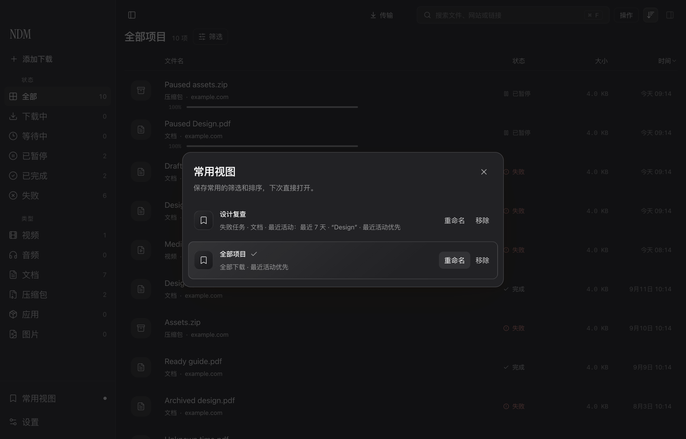
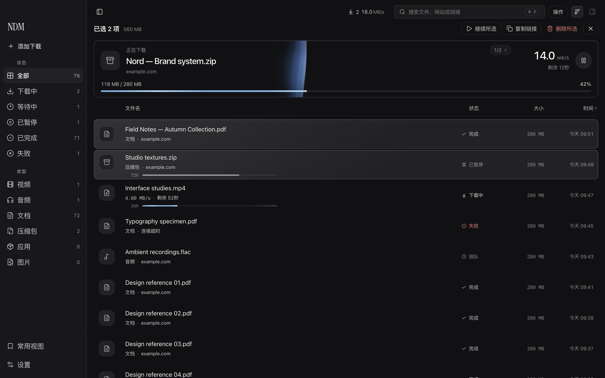
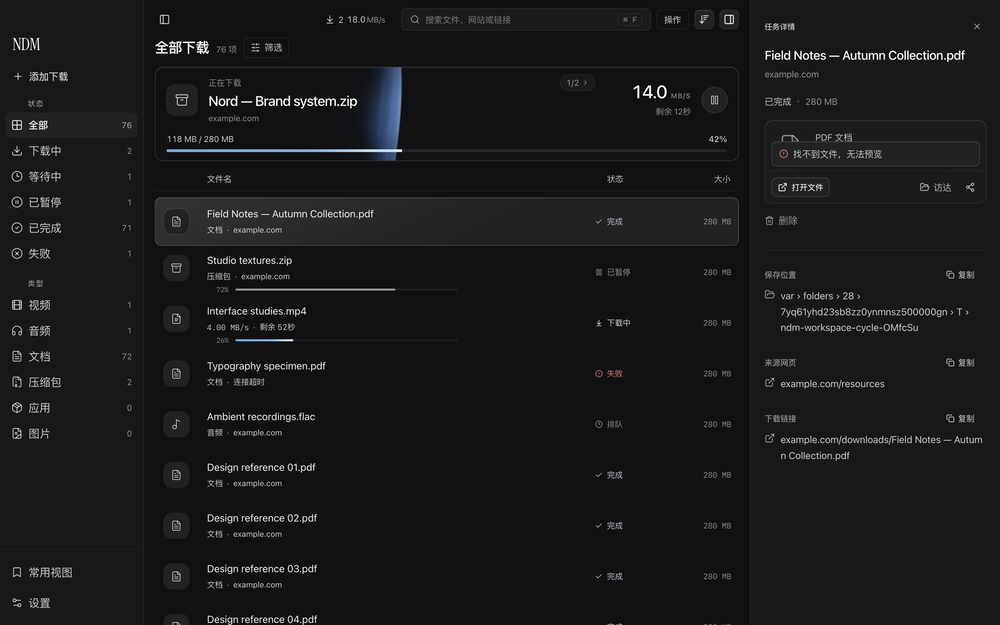
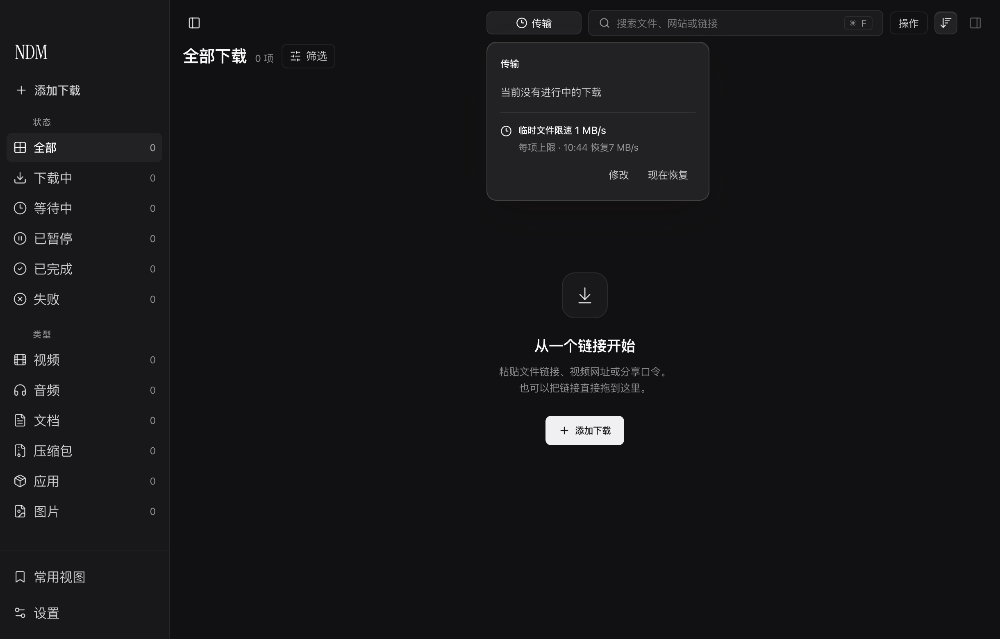
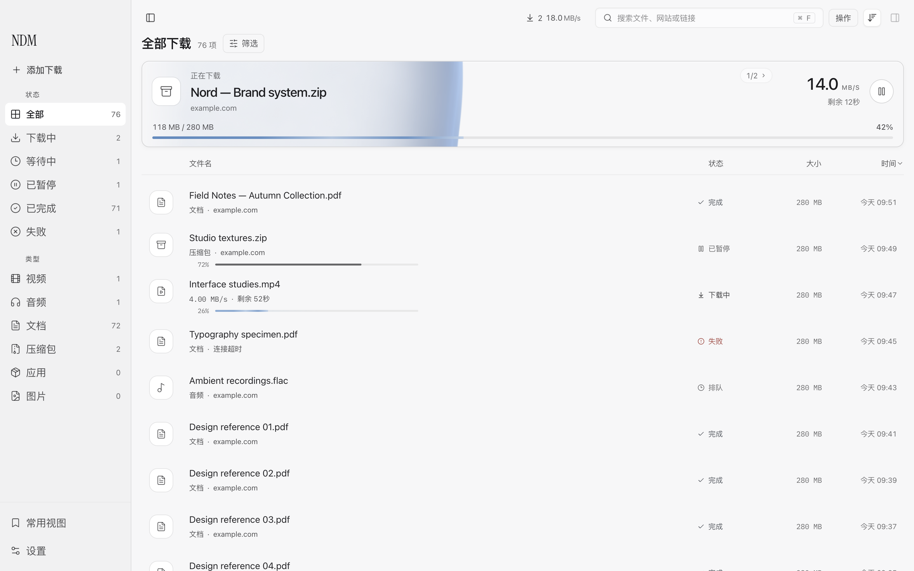

# NDM 持续体验打磨

2026 年 9 月 12 日。接续 [2026091203 的体验审查](2026-09-12-experience-review.md)，保留先前记录作为已发布版本的历史。本轮不是完成三项功能就结束：每次运行检查都继续追踪新发现的问题，包括筛选、文件交付、批量管理、限速反馈、启动与暂停、窄窗口和放大后的布局。

## 设计取舍

沿用用户认可的蓝灰选中材质、三种外观与液态进度。新增功能放在已有工作位置：筛选进入标题行，常用视图只有一个侧栏入口，传输状态进入工具栏。没有再给列表增加常驻横条，也没有为了展示“最近完成”复制一份文件列表。

本轮关注三个可感知的结果：找到同一组文件更快，操作后不会失去原来的位置，反馈与引擎的实际结果一致。视觉上的区分来自边缘、高光、轻微层次和信息密度，而不是每块区域都增加独立卡片。

## 常用视图与组合查找

状态、类型、关键词和最近活动时间可以组合筛选。侧栏切换状态会保留类型；用户可以把组合与排序一起存成常用视图，例如“本周设计素材”。筛选按钮显示条件数，有多项条件时才在标题旁显示摘要，窄窗口让摘要退让，避免重复单一筛选的名称。

视图改名后当前标题即时更新；移除视图只移除偏好，不操作任务或文件。任务变化、跨午夜及窗口回到前台都会更新相对时间结果。输入和存储失败留在当前操作范围，不用永久错误条表达已经取消的重命名。

真实 Electron 中验证了保存、刷新恢复、应用、改名、移除、排序、组合导航、键盘搜索、清除范围和错误恢复。额外审查发现“撞名后取消仍残留错误”，已先复现再修复，并覆盖同一存储错误重复发生的情形。

## 列表位置与操作范围

多选操作直接占用原来的标题位置，列标题和文件不再向下跳。1440 × 900 的受控比较中，旧版多选让列表下移约 65 px；新版选择前后列表起点均为 240 px。切换筛选回到列表顶部，调整窗口和切换所选项目保留滚动位置。

“重试这 N 项”和“继续这 N 项”使用当前筛选结果。大量任务需要二次点击确认；提交时逐项等待结果，部分失败给出可恢复反馈。排队任务参与暂停，不会被“继续”动作反向操作。详情、行内、快捷操作和右键菜单采用同样的语义。

正在下载的主卡补充真实字节数、百分比与剩余时间，并压缩内部间隔。这使常规活动视图比旧卡高约 19 px；它换来持续可读的下载量，不能宣称所有状态都更紧凑。失败列表移除了重复恢复横条，操作集中在标题区域。

## 完成后的文件交付

所选完成文件在详情中有紧凑的文件卡。主操作是打开文件或安装应用，预览区域本身可点击、可拖出；访达与分享保持直接可见。图像与文档预览完整适配容器，不强行裁成横幅。

列表、键盘和快捷操作共用文件交付结果处理。找不到文件或系统操作失败时显示短暂提示，约三秒后消失；提示覆盖在已有区域中，不改变卡片高度。切换文件后，旧文件迟到的结果不会覆盖新文件。

隔离 Electron 验证了缺失文件的真实系统调用、短暂提示、卡片高度不变、窗口变窄、放大与三种外观。此轮未把“调用拖拽接口成功”等同于所有外部 App 已接收文件；跨 App 接收仍需按目标应用验收。

## 传输状态与临时文件限速

工具栏的速度区域可展开查看当前传输、排队任务和暂停操作。临时文件限速提供 15、30、60 分钟，显示恢复时间并允许提前恢复；计时由主进程负责，关闭面板或重载界面不会取消它。设置页面同步展示临时状态，到期后更新原来的自定义速度。

限速恢复记录先写盘，再修改引擎；只有得到明确确认才显示已生效。用户手动改值后取消原恢复计划，断连或休眠后按真实截止时间重新核对。恢复失败保留可重试状态，不伪装成成功。

范围审计发现原有“全局带宽”在 macOS 实际是普通 HTTP 文件的默认单项上限，已有单项设置优先。因此此版本明确使用“默认文件限速 / 临时文件限速”，不把它宣传为所有通道共享的总带宽；Windows 临时入口暂不提供。协议差异与后续方案见 [限速范围审查](2026-09-12-bandwidth-scope-review.md)。

真实原生文件测试以 1 MB/s 限速，随后恢复 7 MB/s；一次观测分别约 0.91 和 6.93 MB/s，最终 64 MB 文件逐字节一致。重启恢复使用隔离记录中缩短的真实截止时间，生产时长未改动；同时验证手动改值及界面重载。实际采样又发现大回调导致数秒进度不动，后续追踪到接收写入阶段，并补充修复。最终同场景约 0.99 / 6.92 MB/s；采样显示持续更新，未再出现之前约四秒的静止。

## 动效依赖真实进度

一次 URLSession 回调可能包含数 MB。旧代码等待整块数据的限速配额后才写入和上报，造成数秒静止后突然跳跃。改为小片段消费配额、落盘、报告进度；配额等待期间不占用分段所有权锁，暂停和磁盘写入失败都保留准确的已写前缀。

新增确定性测试用一次 4 MB 回调复现停顿，并覆盖普通分段与偏移存储、配额耗尽时暂停，以及磁盘只写入七字节后失败的进度一致性。相关 48 项测试通过。液态动画仍只表现真实进度，不靠虚构下载量消除停顿。

## 持续审查中发现的其它问题

- 排队任务暂停后，旧队列回调可能重新启动：已修复，自动启动在取得任务锁后再次核对状态、预约和保存位置确认。
- HLS、FTP、MKV 在启动入口清掉提前收到的暂停信号：已修复；已开始的 HLS 仍保留“停止并保存”语义。
- 空库说明在常规和窄窗口均留下单字末行：调整为自然句与均衡换行，长搜索内容最多两行摘要，清除及扩大搜索仍可用。
- 常用视图重命名失败后取消仍显示旧错误：已修复，并检验下一次真实保存失败仍会出现。
- 200% 放大时，媒体失败说明与按钮被压成窄列：改为上下排列，说明列从 72 扩到 252 CSS px，恢复可读的说明与单行按钮。
- 临时期间创建的 MKV 子下载原先不跟随默认限速恢复：已修复运行中传递；真实双路 HTTP 验证恢复前后 Range 不重发，21 项相关测试通过。

- 批量继续后立即暂停，第二项状态快照尚未送达时会漏发命令：已复现并修复，引擎权威状态在每轮批量操作前读取一次，后续命令不再被旧界面快照否决；固定旧快照时的真实两项暂停及断连反馈回归通过。
- 媒体解析失败时主按钮仍像可以下载：按钮与提交逻辑采用同一判定，保留真实有效的重试和来源网页动作；错误说明区分权限、浏览器信息和非文件响应。

## 验证与交付状态

截图均为合成任务、测试域名或隔离文件，未使用真实任务库资料。

- UI：三种外观；1440 × 900、1000 × 740、740 × 640；多选起点稳定；短暂文件错误、筛选和视图生命周期。
- 行为测试：TypeScript/JavaScript 完整测试及类型检查通过；最终数量见发布记录。
- 原生完整回归：1027 项 XCTest（7 项跳过）及另 11 项 Swift Testing 通过；随后小片段写入另跑相关 48 项测试。
- 原生暂停修复已单独提交并推送：`99189f8`；限速进度与合并恢复：`99eace5`。
- 构建 2026091204 的签名包完成八组隔离流程验收。原生 64 MB 文件逐字节一致，限速/恢复约 1.01 / 6.94 MB/s，采样最大停顿约 1.01 秒。最终 UI 测试为 348 项通过。
- 说明、引导与媒体恢复的[补充截图及受控测试记录](assets/2026-09-12/copy-polish/result.json)明确区分界面测试与外部服务验收。
- 本文为持续工作记录，最新构建安装状态以对应 release 记录为准。

## 接下来的功能方向

| 方向 | 对用户的价值 | 接受条件 |
| --- | --- | --- |
| 跨下载通道的总带宽预算 | 为会议或上传真正留出带宽，一处设置覆盖普通文件与媒体 | 多任务总量受控；活跃 HLS、FTP、合并和外部媒体工具有明确一致合约；到期恢复不遗留单项限制 |
| 文件移动后的重新定位 | 文件被整理到其它文件夹后，直接重新关联，保留历史与来源 | 由用户选择文件；校验可识别信息；不覆盖文件，不把名字相同当作身份相同 |
| 可恢复的待下载清单 | 退出前尚未提交的批量链接，下次打开仍能继续核对 | 本地保存草稿；成功项不再提交；私人链接不会进入诊断或公开报告；明确丢弃与恢复入口 |

这些是下一轮审查方向，并非全部已实现。已完成[待下载清单恢复的五场景审查](2026-09-12-composer-draft-audit.md)，区分保留编辑内容与提交结果不明时的对账；直接持久化可见清单会恢复已成功项，需要避免重复创建。继续以真实场景证明价值，避免为“功能数量”增加界面负担。
