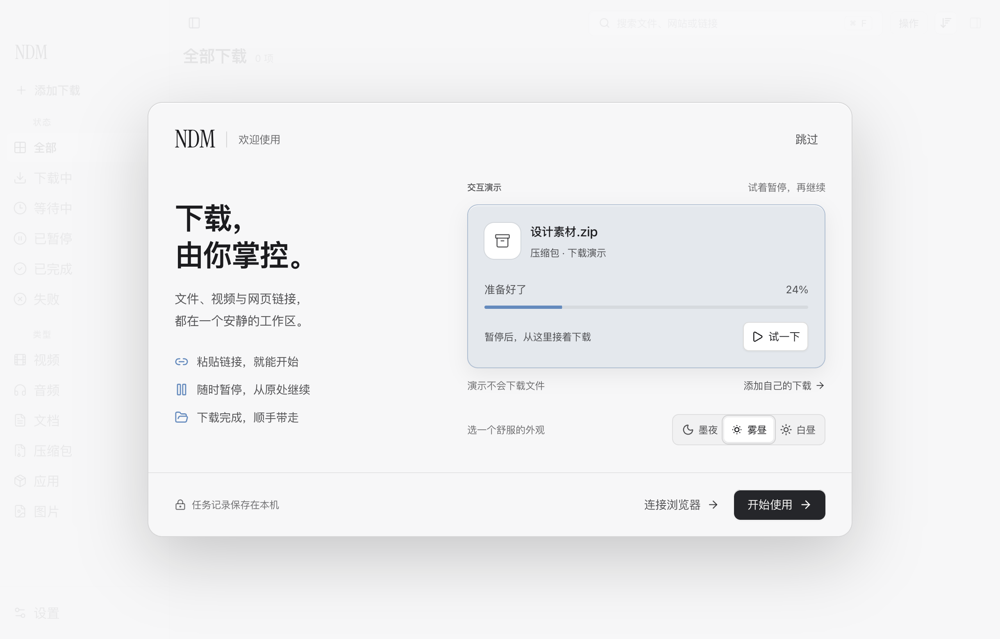
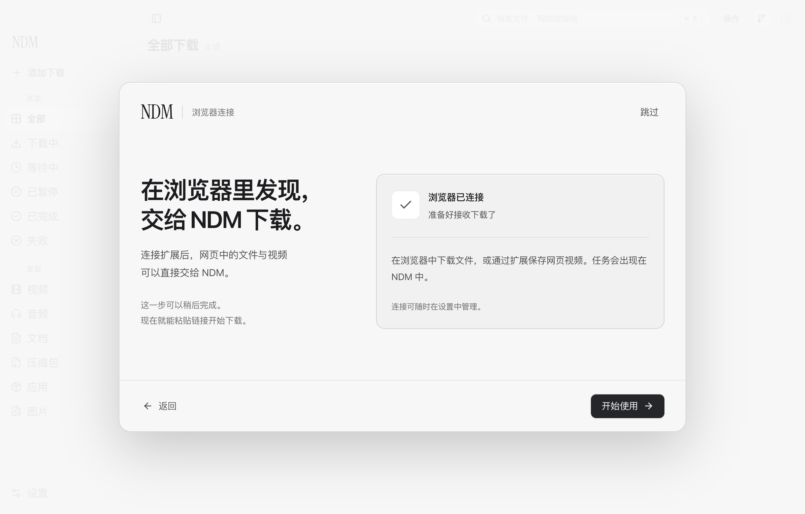
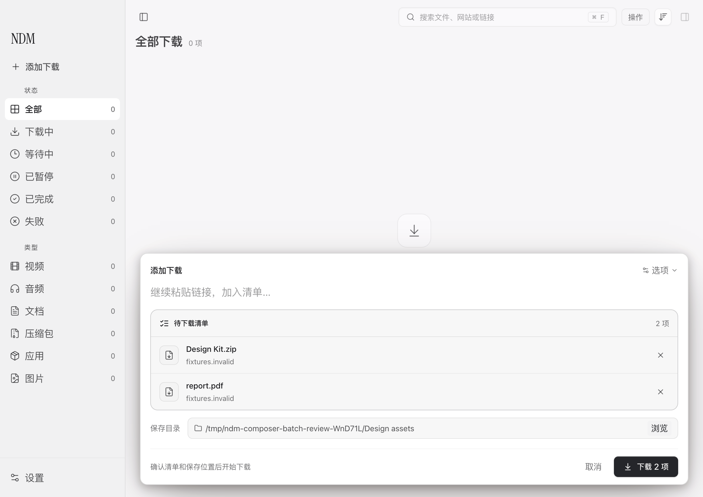
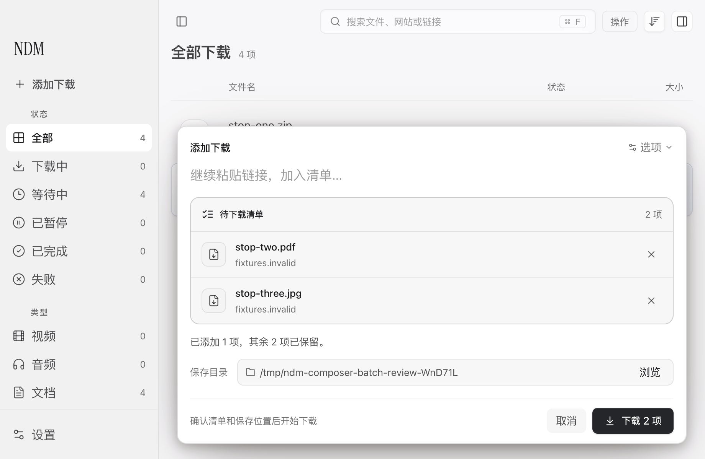
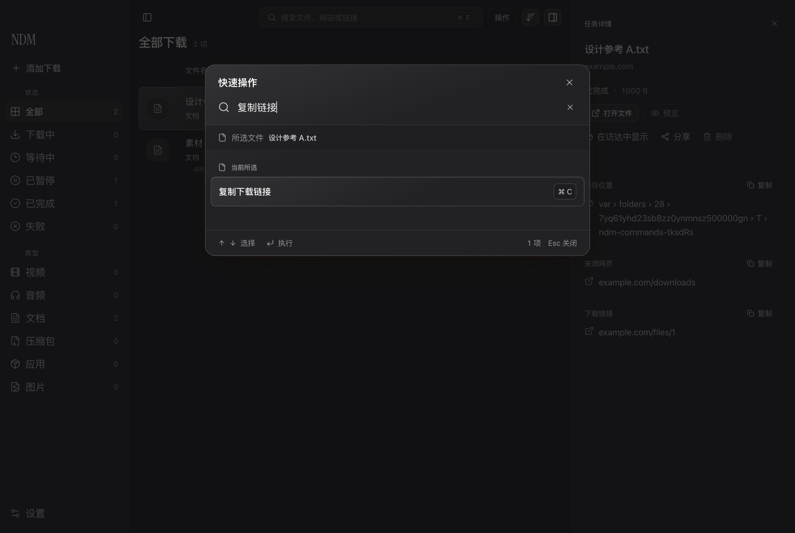

# NDM 体验审查与改进提案

2026 年 9 月 12 日

本轮围绕一条完整路径改进：第一次打开 NDM，理解如何使用，准备下载，处理未完成的操作，再把文件交给下一项工作。设计重点是清晰的层级、连续的操作和可信的反馈。沿用已获得认可的蓝灰选中材质，以细边缘、高光和少量色彩区分状态。

## 1. 首次体验：让用户亲手试一次

**原问题。** 旧引导以技术说明和功能列表为主，正文与操作偏小。页面切换依赖“继续”，缺少直接体验；全局 Enter 会越过当前控件，背后的剪贴板检查也早于用户开始使用。

**本轮实施。** 欢迎页改为可操作的下载演示：开始、暂停、继续、完成、重播。演示明确标注，不创建任务。用户可即时切换墨夜、雾昼、白昼，选择会保留到工作区。首屏提供“开始使用”和“跳过”，无需完成演示。演示进度只在主动开始后推进；减少动态效果时保留操作与进度，停用液态着色效果。

**验收。** 真实 Electron 中验证了完整演示和主题保留。Tab 焦点留在引导内，Enter 只执行焦点按钮，Escape 可退出。引导全过程没有读取剪贴板，没有新增任务。740×600 窗口的主要控件完整出现在首屏；125% / 150% 缩放允许滚动，已修复底栏覆盖主题切换的问题，不通过缩小文字强行塞入。

[查看 150% 缩放后的滚动布局](assets/2026-09-12/onboarding-150-percent.png)

## 2. 浏览器连接：可选、可返回，成功才进入完成状态

**原问题。** 安装目录、技术地址和操作说明占据主要位置；打开目录的反馈容易被理解为连接已完成，安装失败后的提示缺少明确的结束时机。

**本轮实施。** 浏览器连接成为可选第二页。用户始终可以返回欢迎页或开始使用。只有收到当前版本 Relay 的有效连接状态才显示完成；打开目录、旧版本连接、连接中断和状态读取失败分别处理。连接成功后，用简短的使用说明替换安装步骤、目录按钮和过期错误。

**验收。** 控制桥接响应依次验证了未连接、目录打开成功与失败、旧版本、有效连接、刷新失败和断开。打开目录不会触发“已连接”；连接成功后，旧错误消失，之后断开也不会重新出现。本轮验证的是界面如何处理这些状态，没有重新验证真实 Chrome 下载接管。

## 3. 添加自己的下载：先准备清单，再明确开始

**原问题。** 原批量粘贴直接开始创建任务，用户来不及核对链接、移除项目和选择保存位置。实测还发现普通文件的重复检查未触发：定时器被安排在清理回调中，随即被取消。迟到的剪贴板响应会覆盖已编辑草稿，切换媒体格式会替换手动文件名。

**本轮实施。** 引导中的“添加自己的下载”打开添加窗口。多个链接形成待下载清单，保留顺序、合并重复链接，逐项可移除；保存目录和“下载 N 项”同时可见。继续粘贴可以补充清单，粘贴本身不会创建任务。用户改过的文件名、目录和清单优先于迟到的自动填充结果。

**验收。** 验证了粘贴与剪贴板预填都停留在草稿、重复链接合并、移除、选择目录，以及迟到的剪贴板/媒体响应不会覆盖编辑。小窗口打开添加窗口时，浮层侧栏和详情暂时让位，关闭后恢复原选择与侧栏偏好。

## 4. 部分失败和停止：保留进展，也保留下一步

**原问题。** 原批量循环只要有一项成功，结束时就关闭窗口；部分失败的链接没有留给用户继续处理。提交期间按 Escape 也可能关闭仍在等待结果的窗口，任务稍后才出现。

**本轮实施。** 部分成功后，只把未添加的项目留在清单中，保留原保存目录，重试不会再次添加成功项。用户点击“停止添加”后，等待当前请求的结果，再停止后续项目；界面说明已添加多少、还保留多少。单项请求等待结果时，Escape 不会丢弃这次交接。

**验收。** 通过受控失败和延迟响应验证：两项中一项失败时，只重试失败项；三项提交中停止时，仅当前一项得到确认，余下两项保留并可继续。部分成功没有让详情栏突然挤窄仍在编辑的清单。

这里的“停止添加”停止的是清单提交，已经建立的下载任务由列表继续管理。清单恢复验证覆盖当前添加会话，不表示应用退出后可以恢复未提交的草稿。

## 5. 快速操作：从找到命令到完成交接

**原问题。** 常用动作分散在列表、详情、设置与快捷键中。新增入口如果只增加一个菜单，会提高学习成本；对话框之间的焦点交接也容易让用户执行完操作后失去位置。

**本轮实施。** 工具栏“操作”和 ⌘K 打开快速操作。按“当前所选”和“工作区”组织可搜索的命令，明确显示作用对象与常用快捷键。未完成文件的预览等操作保持不可执行，批量选择只提供适用的批量动作。删除继续交给现有确认流程。

**验收。** 签名安装包通过搜索匹配、方向键循环与滚动、中文输入法确认、无结果、禁用结果、Escape 保留选择，以及跳转到添加、设置、搜索和删除确认后的焦点交接检查。额外修复了设置打开后焦点未进入页面的问题；验证了设置内 Tab / Shift+Tab、进入清理确认和重看引导，以及退出设置后保留原任务选择。对应脚本为 `scripts/qa-command-palette.mjs`。

快速操作仍调用现有下载与文件能力。本轮不把菜单跳转成功等同于每个系统动作或外部 App 交付都已重新验证。

## 后续提案：优先扩展已有使用路径

以下三项尚未实现，优先级是建议实施顺序。

| 优先级 | 提案 | 具体体验 | 验收标准 |
| --- | --- | --- | --- |
| P1 | 保存筛选视图 | 将常用的状态、类型、来源和关键词组合保存为命名视图，例如“本周的设计素材”。放在侧栏的视图区，使用现有列表与详情。 | 重启后保留；任务状态变化时结果正确更新；空结果不重置筛选；重命名和移除视图不影响下载任务或文件。 |
| P1 | 最近完成交付区 | 在“已完成”中提供紧凑的最近文件区，直接预览、在访达中显示或拖到其他 App；清楚显示这是哪个文件。 | 新完成项目不会抢焦点或推动用户正在看的列表；空格预览与列表一致；文件移走后给出短暂反馈；真实拖入目标 App 验证成功，单纯调用拖拽接口不算通过。 |
| P2 | 临时限速，自动恢复 | 从速度控件选择“限速 15 / 30 / 60 分钟”，显示剩余时间，随时恢复。适合会议、上传或其他工作临时需要带宽的场景。 | 到期恢复此前设置；用户手动改限速时以新选择为准；休眠唤醒和应用重启后按截止时间处理；用受控下载测量实际限速与恢复，不只检查界面数值。 |

## 验证范围与证据

本轮截图均来自隔离测试资料：空任务库或合成任务、测试域名和临时目录，没有真实用户下载记录或个人扩展目录。

- 新引导：`scripts/qa-onboarding-experience.mjs`，8 组交互检查通过；覆盖三种外观、键盘、可选连接、减少动态效果及缩放布局。
- 添加与恢复：`scripts/qa-composer-batch-review.mjs`，受控响应验证草稿、部分失败、停止、异步编辑保护及浮层恢复，未进行真实远程文件下载。
- 快速操作：`scripts/qa-command-palette.mjs`，最终签名包全部通过，截图来自该轮运行。
- 真实下载：`scripts/qa-drop-entry.mjs`，隔离原生引擎从本地 HTTP 服务完成 6 MB 文件下载，确认前没有任务，完成字节数一致。
- 原有工作区：签名包通过 `scripts/qa-interaction-polish.mjs`，检查设置提示音与字号、侧栏展开、悬停操作、网址不在连字符处折行、选中材质、拖出文件和短暂失败提示。

界面边界场景采用受控引擎/桥接响应，真实下载使用本仓库原生引擎；未覆盖所有平台、辅助技术或第三方浏览器环境。这里记录具体体验和回归证据，不作奖项资格或全面认证声明。版本、签名、安装和部署结果见[构建 2026091203 发布记录](../releases/2026.9.12-build.2026091203.md)。

## 参考依据

欢迎页采用“可以跳过、通过体验学习”的方式，参考 Apple 对简短、可选引导的建议。[Apple：Onboarding](https://developer.apple.com/design/human-interface-guidelines/onboarding?changes=_7)

液态进度与页面切换服务于进度、状态和操作反馈；本轮没有加入与任务无关的自动播放展示。[Apple：Motion](https://developer.apple.com/design/human-interface-guidelines/motion?changes=_3)

连接结果与批量恢复留在对应操作附近，避免通过额外弹窗打断当前工作。[Apple：Feedback](https://developer.apple.com/design/human-interface-guidelines/feedback)
