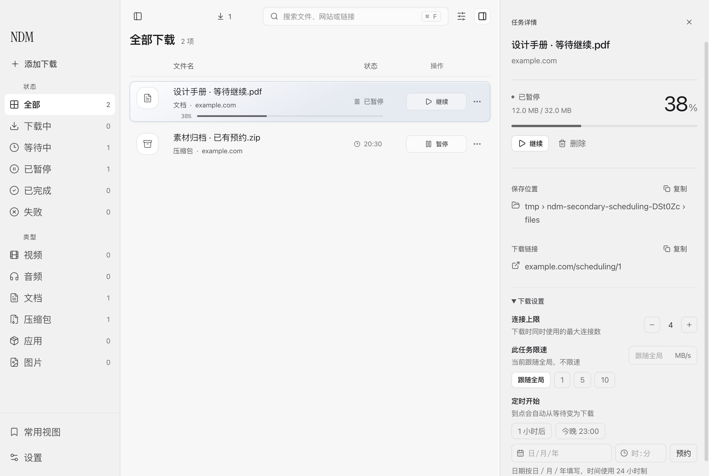
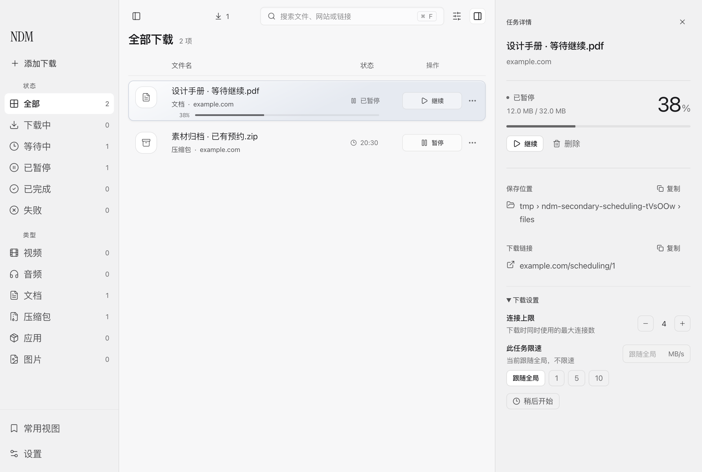
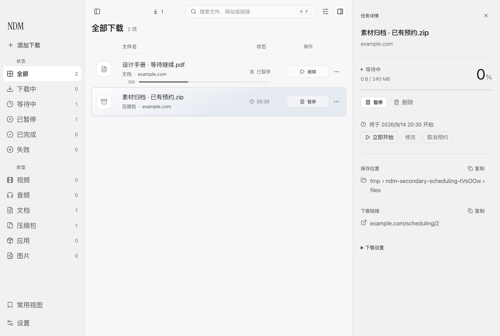

# 稍后开始：保留能力，收起日常表单

未预约任务的“下载设置”只显示一个“稍后开始”入口。点击后才出现日期、时间与明确的预约按钮；移除常驻的“1 小时后”和“今晚”建议。展开或取消编辑不会发送下载、预约指令。

已有预约在任务详情中持续显示完整年月日和时间，不受“下载设置”折叠影响。立即开始、修改、取消预约保留在同一处。编辑期间等待回执时，表单保持原位；成功后才更新预约摘要。取消编辑将键盘焦点交回入口。

## 取消与立即开始的区别

沿用现有引擎指令，没有修改调度器或任务数据格式。单独清除 macOS 的预约可能使等待任务进入可启动队列，Windows 的暂停则不会自行清除预约时间，所以界面先暂停，再清除预约。取消到此结束；立即开始才继续发送恢复指令。每一步等待明确回执，前一步失败不会继续。预约与普通任务、批量、全局传输、合集及删除共用界面操作锁；事务中其他生命周期操作暂时禁用，预约目标行显示“更新预约”。恢复阶段失败会说明预约已经取消、尚未确认启动，避免只显示模糊的“保存失败”。

这是多个既有指令的顺序调用，不是跨引擎原子事务。中途连接中断可能已经完成前面的步骤，界面按阶段报告结果，并等待后续任务快照，不回填旧预约或虚构成功。

## 验证范围

[`qa-secondary-scheduling.mjs`](../../scripts/qa-secondary-scheduling.mjs) 使用真实 Electron main、preload、renderer 与私有 TCP 合成任务。检查展开/取消无写入、日期校验、延迟与失败回执、已有预约更改、取消保持暂停、立即开始指令顺序，以及窄窗、缩放和三主题的表单边界。运行记录包含构建指纹、请求与截图。

- [改动前证据](assets/2026-09-12-secondary-scheduling/before/result.json)
- [改动后证据：Mac 暂停会清除预约](assets/2026-09-12-secondary-scheduling/after/result.json)
- [模拟 Windows 暂停保留预约的约定](assets/2026-09-12-secondary-scheduling/after-windows-pause/result.json)

最终生产实现提交为 `44feaaa`。Mac 约定的真实 Electron 运行通过 11 组检查，15 张完整窗口截图，0 页面错误；窗口与任务始终隔离。Windows 约定使用同一 Electron fixture 改变暂停行为来验证，不是 Windows 系统实测。

`taskScheduleActions.test.mjs` 实际调用 renderer store 包装，验证成功顺序及每个阶段的否定回执/传输异常不会继续执行。既有 `qa-schedule` 和 `qa-task-adjustment-failures` 已适配新入口，但本轮没有启动真实下载引擎来重验定时触发、持久化或下载成品。这些边界与 UI/IPC 验证分开记录。
