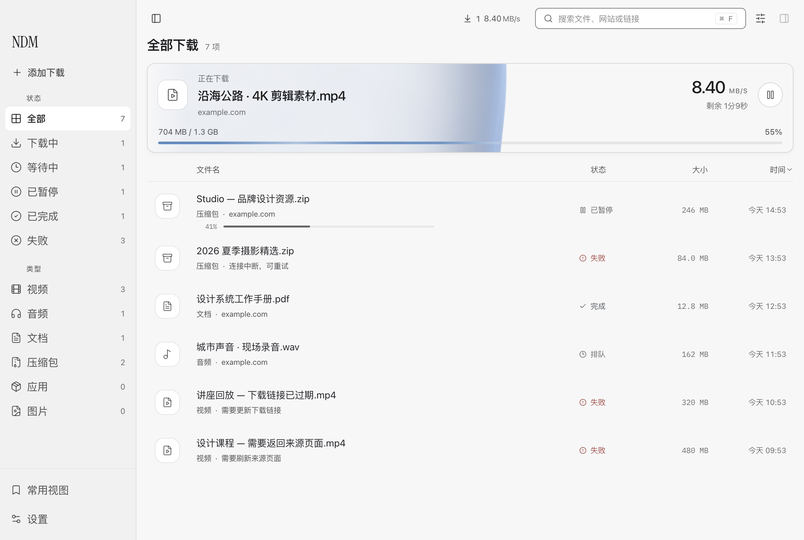
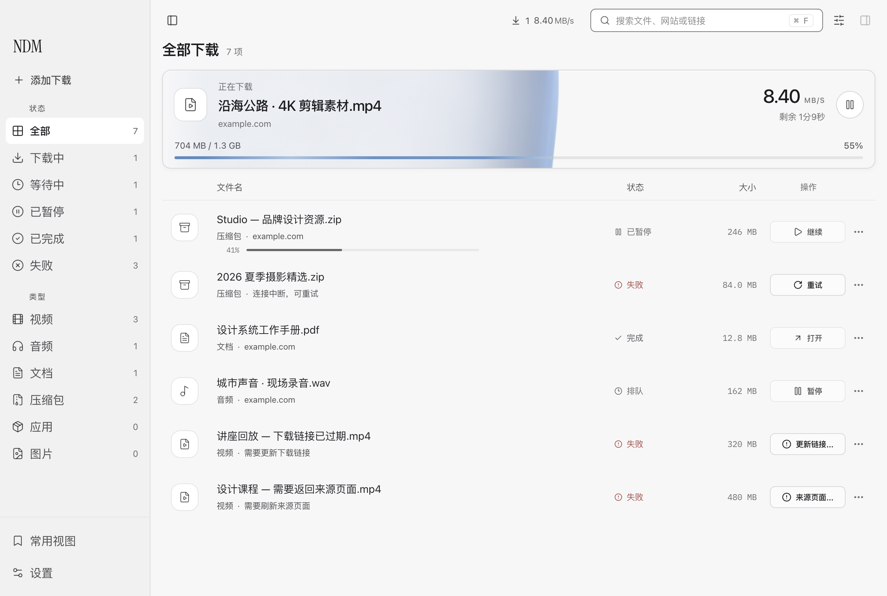
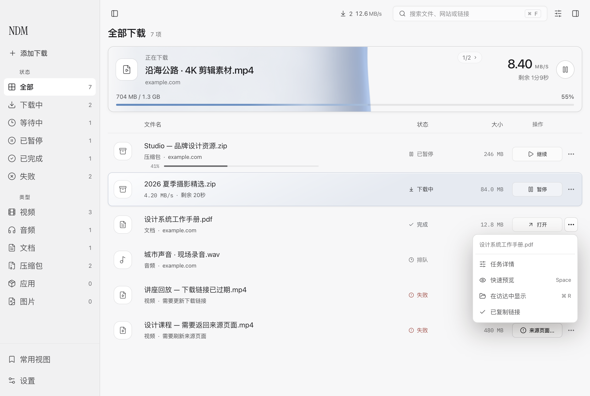
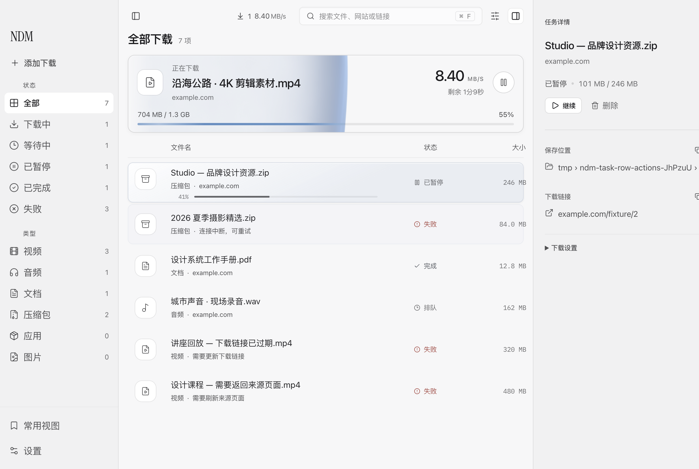
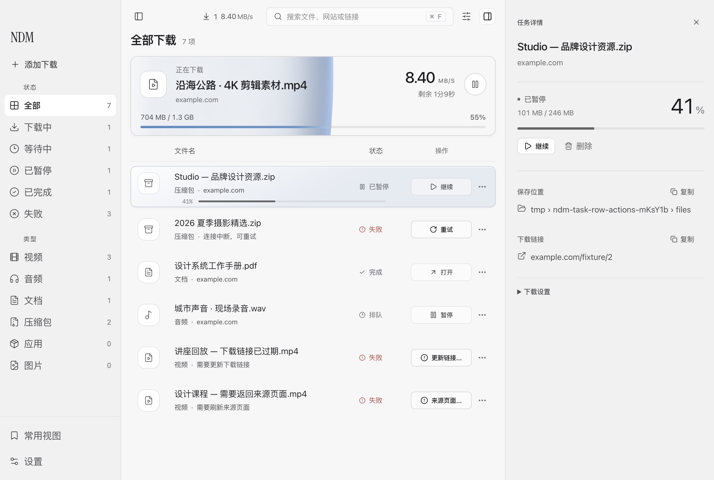
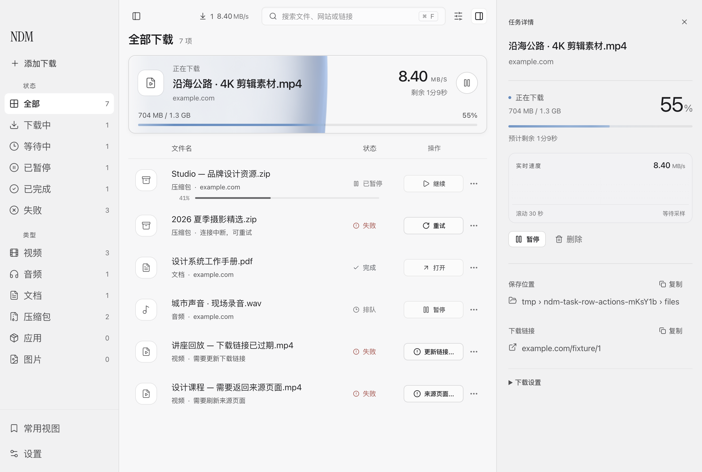

# 任务状态、下一步与详情进度

这轮把「找到一个任务 → 看懂当前状态 → 执行下一步」作为一条连续体验打磨。沿用 NDM 的中性表面、清晰字号与选中材质，重排操作和进度的信息层级。

## 看见下一步

之前，任务操作依赖悬停，按钮覆盖尾部信息时会让元数据淡出、文件名截短。现在每行预留固定操作区，直接显示「暂停」「继续」「重试」「打开」，合集也使用对应文字。文件名、速度、进度和状态不因鼠标移入而改位。

操作列独立标注「操作」。窗口变窄时，次要信息按空间收起；时间排序仍可从「显示选项」使用。传输进度在窄列表中放到文件名下方，保留速度和剩余时间。

## 操作连续，恢复明确

失效链接和来源页面问题分别显示「更新链接…」「来源页面…」，进入现有详情恢复流程；可直接重试的连接错误仍显示「重试」。方向键改变选区后，Enter 根据当前所选任务执行相同行为。

主按钮在等待回执时显示「正在继续」「正在暂停」等状态并禁用重复点击。失败沿用任务操作反馈；不会把请求发出当作成功。更多菜单容纳详情、文件预览、显示位置和复制，复制失败可就地重试，Escape 返回触发按钮。

## 详情读得更清楚

非完成任务以进度数字作为视觉重点，状态、已下载量与预计剩余时间围绕同一条进度轨道排列。暂停后保留已有进展。直播显示时长与已保存字节；大小未知且引擎只给出 `progressFraction: 0` 占位时，不显示虚假的百分比。100% 仍以真实任务状态判断是否完成。

## 基线与验证边界

实现已接到 PR #4 的完整头 `3f0c464cb02c16ea818d7ed8e1d77b03bcbcb330` 之后，保留其标题栏、视频创建与 Relay 修复。原有工作区 QA 的冲突仅出现在已被新操作区替代的悬停淡出断言；保留 PR #4 其余脚本修正。

前后截图均来自真实 Electron 的独立窗口与合成任务。前图使用 PR #4 的独立归档构建，后图使用本分支构建；不是概念图，也没有读取个人下载记录。点击操作通过真实 renderer → preload → main 通路，下载引擎和系统文件/剪贴板动作返回受控回执。该验证证明界面与命令交接，不代表重新验收 Swift 下载或真实应用安装。

`scripts/qa-task-row-actions.mjs` 覆盖三主题、740 像素窗口与真实 125% / 150% 缩放、悬停稳定性、菜单焦点、双向键盘选区、延迟和失败回执、录制保存、未知总量、媒体分片进度及合集展开。运行报告保留构建指纹与原生截图尺寸。

- [前图来源与测量](assets/2026-09-12-task-actions/before/result.json)
- [后图、交互与构建指纹](assets/2026-09-12-task-actions/after/result.json)
- [命令交接记录](assets/2026-09-12-task-actions/after/command-receipts.json)
- [交互式前后查看](2026-09-12-desktop-review.html)

本批另外完成了[完成与安装浮层](2026-09-12-transfer-activity-compact.md)、[设置与添加入口精简](2026-09-12-entry-simplification.md)和[稍后开始](2026-09-12-secondary-scheduling.md)。没有修改 Relay、原生引擎或个人保存的设置，没有覆盖安装主应用，也没有迁移既有任务或下载默认值。视觉效果以实际截图供用户判断，不作主观设计评级。
