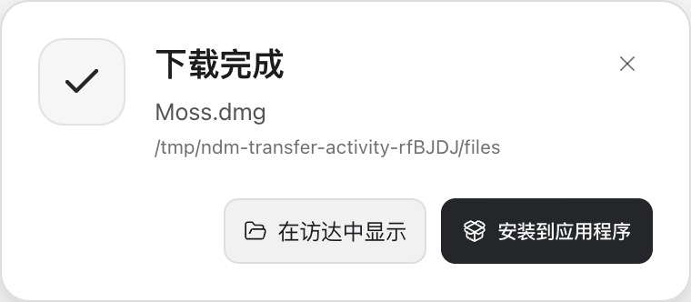
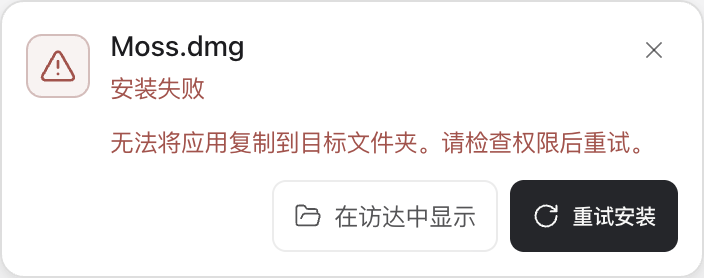

# 完成提示与安装进度的紧凑化

范围：`TransferActivity.tsx` 与专用 `transfer-activity.css`。沿用现有完成通知和安装阶段事件，主进程、安装器和下载引擎不变。

## 当前流程审查

在本次隔离 Electron 窗口中，沿“下载完成 → 准备 → 安装中 → 结果”捕获前态。全部文件、路径和安装指令均为专用 fixture；没有挂载磁盘映像、复制应用或启动真实应用。

1. **下载完成：可用但过厚。** 380 × 165.75 CSS px。48px 图标、18px 状态标题、20px 四周留白及独立操作行抢占空间，真正要辨认的文件名成为次要内容。
2. **准备与安装中：状态正确，信息重复。** 380 × 125.75 CSS px。大标题和下方详情常重复描述同一步；不存在安装百分比，因此现有不定量指示应保留其真实含义。
3. **成功：行动明确，比例仍松散。** 380 × 148 CSS px。打开应用和显示位置保留。
4. **失败及取消：恢复信息不够完整。** 380 × 165.75 CSS px。失败原因被省略号截断；取消只有显示位置，缺少直接重新安装。

## 设计与实现

- 文件名成为 14px 主信息；状态和经确认的下载大小合并成 12px 次行。无大小来源时不显示数字。同一安装包从完成通知进入安装阶段，保留已经确认的大小；不从安装阶段推算大小或百分比。
- 宽度改为 352px，四周留白 12px，图标 32px，圆角 12px。减少的是留白、图标和重复层级；动作按钮仍高 36px，关闭按钮从 28px 增为 32px。
- 安装过程中保留阶段名称和无百分比的不定量指示。等待系统选择时停止流动；减少动态效果时不把动画冻结成虚假的部分完成值。
- 失败原因允许换行，失败和取消都有直接重试入口。应用打开失败保留当前提示并显示原因；收到成功回执才收起。
- 异步回执限定在原文件和原阶段。旧安装错误不能覆盖后续阶段，旧应用打开回执不能收起另一个文件的安装提示。

## 验证结果

最终真实 Electron 验收通过，17 个状态截图及两个工作区截图已逐项检查。测量为 CSS px，宽度从 380px 收至 352px；按钮仍高 36px，文件名由 13px 增至 14px。

| 阶段 | 原高度 | 当前高度 | 减少 |
| --- | ---: | ---: | ---: |
| 下载完成 | 165.75 | 112 | 32% |
| 准备／挂载／检查／复制／收尾 | 125.75 | 78 | 38% |
| 等待系统选择 | 125.75 | 105 | 17% |
| 安装成功 | 148 | 112 | 24% |
| 失败／取消 | 165.75 | 139 | 16% |

安装结果保持到用户关闭、成功打开应用或下一次安装。应用打开失败等待 8.5 秒仍可见且可重试；迟到的安装错误和打开成功回执均不能影响新文件或新阶段。Tab、Enter、Space 操作通过，通知到达不会抢走现有焦点。

前态记录：[before/report.json](assets/2026-09-12-transfer-activity/before/report.json)；最终记录：[after/report.json](assets/2026-09-12-transfer-activity/after/report.json)。最终构建为 `44feaaa93dfb6ed5931c33d5c40645d731e6dc52`。报告包含 main、preload、renderer 的 SHA-256；本次完整重跑实际执行了运行前后构建指纹一致断言并通过，证明验收期间构建未被替换。

首轮发现运行中改变“减少动态效果”不会更新 Motion 的初始偏好，已补专用 CSS 媒体查询，最终验证动态切换立即隐藏不定量填充。740 × 640 真实窗口、150% 缩放及深色主题下，提示与动作均在视口内。非 1 倍缩放使用 Electron 原生 `capturePage`，避免 DevTools 元素截图裁切错误。未知大小不显示数值，后续直接安装不会继承前一个完成通知的大小。

## 验证边界

专用脚本覆盖短／长文件名、完成、准备、挂载、查找应用、复制、收尾、等待选择、成功、失败、取消、键盘焦点、打开应用失败、迟到回执、真实 Electron 150% 缩放和减少动态效果。系统文件操作和安装调用只记录隔离路径回执。这证明界面布局和命令交付，不代表重新验证了真实安装器。

复现：在统一构建后运行 `node scripts/qa-transfer-activity-compact.mjs`。前态从修改前保存的独立 `out` 运行，使用 `NDM_QA_TRANSFER_APP_ROOT` 指定目录并加 `--before`。
