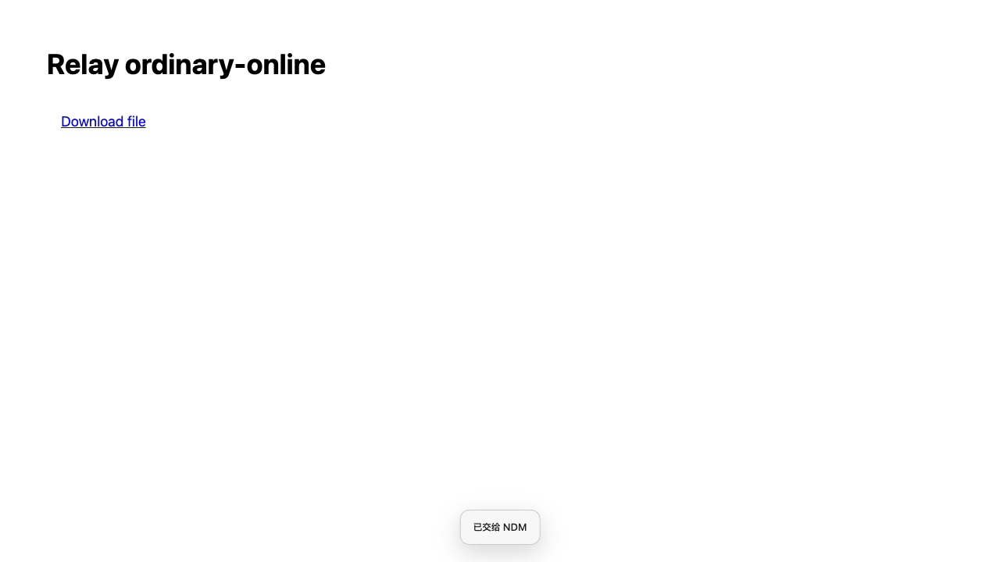
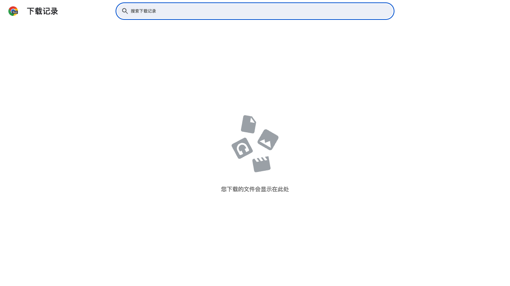
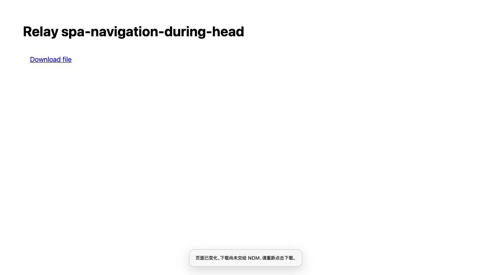

# Relay 在 Chrome 创建下载项前接管

日期：2026-09-12。Relay 1.4.15。这里记录 PR #5 的前置接管阶段，冻结提交为 `d6e46c0`（前一媒体弹窗提交为 `6a19252`）。随后追加的 iframe/other 后置覆盖与最终源码验收见 [下载覆盖修复](../relay-download-coverage/README.md)。native 安全能力由 PR #6 单独维护，本分支没有修改 native 或桌面源码。

## 行为与边界

扩展在可信、无修饰键的顶层同源链接点击中接管普通 GET 下载。只处理 `_self` 目标，遵守网页已取消的点击，跳过脚本链接、POST、blob/data、跨源起始链接、noreferrer 和限制 Referer 的页面。明确的 `a[download]` 不增加浏览器预检请求；没有 download 属性的 ZIP/7z/rar/tar/gz/bz2/xz/dmg/pkg/iso 链接，仅在无 query/hash、同源 HEAD 返回确认文件类型后接管。HEAD 最长 1500ms，不跟随重定向，HTML/JSON/错误不当作文件。

Chrome 不提供浏览器管理的 Basic/Digest 认证缓存。对已观察到 `401 + WWW-Authenticate` 的来源，只记录会话内的来源标记，保持浏览器下载，不提取或转存认证值；200 响应和 worker 重启不清除标记。Cookie 认证仍使用既有作用域捕获。扩展开始观察之前已有的 HTTP 认证缓存不一定能被识别，因此不承诺所有认证流程都能前置接管。

前置接管同时要求 Host 声明 `durableHandoff: 1` 和 `safeFileRedirects: 1`。旧 Host、能力未知或离线时保留原浏览器路径。HEAD 未确认时恢复原链接默认动作；既有响应头接管仍可在实际文件响应后工作，因此这类路径可能仍创建 Chrome 下载项。异步恢复使用只复制必要属性的链接，避免重复执行网页已有点击处理；它是合成默认动作，不等同于重新产生可信用户事件。

新路径不使用 Chrome 下载创建、暂停、取消或擦除 API。页面的“已交给 NDM”只在 native 持久接收回执后显示，不表示文件已经下载完成。已经发送但回执未知时保留原 requestId 和完整 payload 重试，不能同时恢复 Chrome；重复点击不会创建第二个 intent。明确未发送或首次确定拒收后，先登记 tab/frame/document/URL 范围内的一次性 bypass，再恢复浏览器下载。

会话 outbox 使用 `chrome.storage.session`，不承诺跨浏览器退出恢复未确认意图。已提交任务由 native 持久保存。终态记录有界保留；`payload-mismatch` 表示 ID 已被占用，必须保持未确认，不能因此开始另一份浏览器下载。

## 原版体验与覆盖范围

本地原始 Chrome 扩展归档 `chrome_store` 的 manifest 为 1.9.92/MV3。源码及纯 Node VM 证明它在 `downloads.onCreated` 之后立即 cancel/erase，没有等待逐请求 native ACK。这个证据不证明真实 Chrome 是否短暂显示气泡，也不证明归档是当前商店最新版。用户当时“没有看到 Chrome 提示、下载列表没有留下项目”的体验可以成立；不能仅据肉眼观察断定内部没有 DownloadItem。归档没有额外隐藏下载 UI 的调用或权限。当前 Relay 的旧路径等待持久 ACK 后再处理已创建的 Chrome 项，因此保留时间会更长。

原版自动覆盖确实更宽：原始代码 VM 验证了 sub_frame/other zip、POST 附件等。`d6e46c0` 阶段的后置自动路径仅限 main_frame；原版可捕获的部分 iframe/other 请求在此阶段只是资源候选。这是已确认的产品覆盖差异。后续修复保持网页资源护栏，在真实 Chrome DownloadItem 出现后恢复有明确来源的普通 GET 文件覆盖，见 [修复与前后对比](../relay-download-coverage/README.md)。通用 POST、blob/data 和 iframe 下载不属于零下载项保证。

`6a19252` 同一隔离 fixture 的普通 ZIP 基线：可信点击后 37ms 创建 Chrome 项，51ms 发桥接，53ms 收 native 回执，60ms Host 开始下载。它是一次本地时序测量，不是性能保证。完整来源核对见 [原版与 API 证据](original-and-api.md)。

Chrome 官方 [downloads API](https://developer.chrome.com/docs/extensions/reference/api/downloads#event-onCreated) 定义 onCreated 为下载已开始时的事件；erase 只删除历史。普通 MV3 的 [webRequest API](https://developer.chrome.com/docs/extensions/reference/api/webRequest) 没有一般可用的 webRequestBlocking，因此不能把非阻塞响应监听或隐藏下载 UI 当作“从未创建下载项”。

## 跨源重定向安全门槛

早期真实 QA 揭示旧 Host 的确定回归：同源 `a[download]` 的初始 URL 302 到另一主机名时，native HEAD/GET 将源站 host-only Cookie 和完整 Referer 带给跨源目的地。冻结 `6a19252` 在同一 Host 下先由 Chrome 处理重定向，再向 native 交付最终 URL，目的地无源站 Cookie、Referer 仅为 origin。测试仅使用合成凭据。

因此 `safeFileRedirects: 1` 不是测试开关。只有覆盖 HEAD/probe、首次 GET、Range 以及采用最终 URL 后重新构造请求的原生实现才能声明它；不能通过预先 HEAD 成功来推断未来 GET 安全。扩展缺少该能力时严格不启用前置路径。原生修复由 `codex/safe-link-renewal` / PR #6 负责。

## 验证记录

前置接管冻结阶段 **30/30** 真实场景通过，使用原生提交 `409448a1f73a28727bf4bcb7b61d2577d6852d5c` 的冻结二进制，SHA-256 为 `f60857dfdf23ad76d995e644fef920c43d0ff9a72e171184a8c04bc2606206e2`。实际握手同时声明两项安全能力，没有伪造能力或跳过验收断言。

10 个支持场景由 NDM 完成且 Chrome 创建/interrupted/擦除均为零；13 个场景由 Chrome 独占完成；4 个未确认场景保留旧接管行为；3 个页面场景没有创建下载。所有下载均匹配 2,097,152 字节合成源文件的 SHA-256。跨源目的地的真实 HEAD 和 GET 均未收到 Cookie、Authorization 或 Referer。

[逐场景表](scenarios.md)与[机器可读冻结结果](verified-results.json)记录处理者、任务数、事件计数、能力与源文件/Host/脚本哈希。30 个报告与冻结提交 `d6e46c0` 的扩展生产文件哈希一致；后续覆盖修复改变的源码另行验收，不将本组冻结结果表述为最终源码全量重跑。普通 ZIP 在一次本地测量中点击后 13ms 发送、17ms 回执、23ms Host 进入 downloading；不作为通用性能基准。此前第一轮 13 场景仅为调查记录，不替代这一最终验收。

已完成的保护与回归：

- 旧 Host 三场景真实 gate 验证：没有 early intent、没有浏览器 HEAD；普通文件走旧路径，download 属性链接由 Chrome 完成；跨源目的地不收到源站 Cookie 或 query token。
- 冻结阶段 Relay Node 203/203、浏览器回归 45/45（包含媒体弹窗）、桌面 Node 430/430；typecheck、build 通过。
- 配套原生任务在同一 `409448a` 完整测试报告 1095 项、8 跳过、0 失败；原生代码与 PR #6 独立维护。本 PR 的 native 源码仍为原基线，须组合 PR #6 后构建才能启用安全前置能力。
- 所有 live QA 使用独立 Chrome profile、NDM support/download 目录和桥接/Host 端口，不安装覆盖主应用；清理结果逐场景记录。

## 复现

在 macOS 上准备本仓库依赖及媒体工具，选择配套安全 Host 的真实二进制。脚本默认使用 Playwright 安装的 Chromium；可以用 `NDM_QA_BROWSER_PATH` 指定实际 Chrome for Testing 可执行文件。

```sh
npm run fetch:mac-tools
NDM_QA_HOST_PATH=/absolute/path/to/frozen/NDMHost npm run qa:relay-file-clicks
```

脚本入口为 [qa-relay-file-clicks.mjs](../../../scripts/qa-relay-file-clicks.mjs)，透明故障代理为 [qa-relay-file-clicks-proxy.mjs](../../../scripts/qa-relay-file-clicks-proxy.mjs)。`NDM_QA_CASE` 可选择逗号分隔的场景；`NDM_QA_OUTPUT_DIR` 指定报告位置。`NDM_QA_EXPECT_LEGACY_HOST=1` 用于缺安全能力的旧 Host 兼容验证，不能计作前置接管成功；`NDM_QA_EXTENSION_SOURCE` 用于冻结扩展来源。

丢回执代理仅丢弃第一个真实 Host ACK，其余字节原样转发。首次拒收代理截住完整客户端请求、确保它未进入 Host，再给出合成拒收；队列满场景使用有标记的合成 admission reservations。这些故障注入界线与真实 Chrome/Host 完成结果分开记录。

## 页面实拍

页面留在原位置并显示真实接收确认：



Chrome 最终下载页为空；真正“从未创建”由上述完整 onCreated 事件记录证明，不能仅看这张截图判断：



准备期间页面发生变化时保留新页面并明确提示尚未交接：


