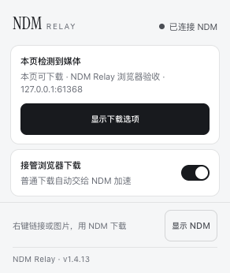
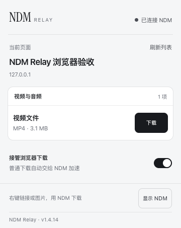
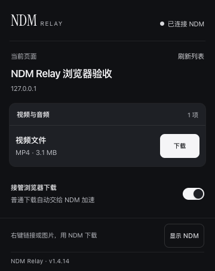
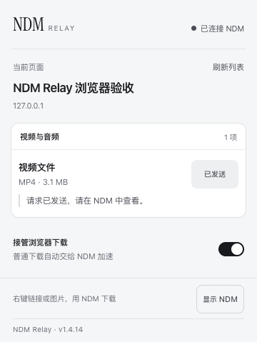
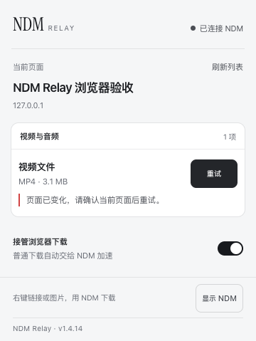
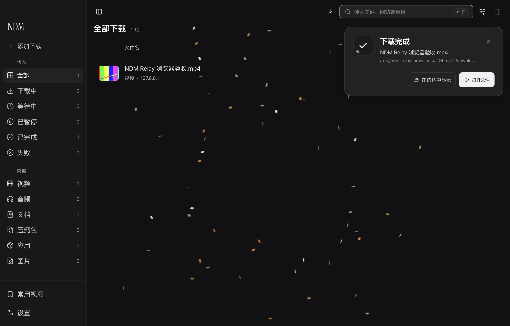

# Relay：从发现媒体到直接下载

验证日期：2026-09-12。版本：Relay 1.4.14，冻结于 `6a19252`。后续 1.4.15 的前置点击接管见[独立验收记录](../relay-click-handoff/README.md)。

原弹窗只能显示“检测到媒体”。用户必须点“显示下载选项”，关闭弹窗后到页面浮层再次选择下载。现在弹窗直接列出本页视频与音频，显示格式、已知大小，并提供下载和发送反馈；普通文件、站点解析入口、原页面浮层继续可用。

## 前后界面

同一本地认证媒体页面、真实扩展代码。前态截图是 292px 的扩展 popup 页面；后态另通过 `chrome.action.openPopup()` 捕获真正的 Chrome 工具栏弹窗，其内容区域实测 **360 × 453px**，没有水平溢出。

| 改进前 | 改进后 | 深色 |
| --- | --- | --- |
|  |  |  |

沿用中性石墨配色、Instrument Serif 品牌字体及系统正文。页面上下文、资源选择和下载接管设置有清楚的层级；长标题最多两行，资源区内部滚动，弹窗最高 600px。保留中英文本、键盘焦点及减少动效设置。

## 流程验收

| 步骤 | 改进与实测结果 | 状态 |
| --- | --- | --- |
| 1. 发现 | 用户点击前不创建任务；弹窗显示真实捕获的 MP4 与 3.1 MB 大小 | 通过 |
| 2. 选择 | 直接点击弹窗“下载”，无需返回页面浮层；发送期间阻止重复点击和列表替换 | 通过 |
| 3. 确认 | 保持弹窗并显示“请求已发送，请在 NDM 中查看”；刷新保留当前弹窗中的发送状态 | 通过 |
| 4. 页面变化 | 真正导航来源页后，旧选择被拒绝且没有创建任务；刷新后新选择可以正常发送 | 通过 |
| 5. 桌面完成 | 实际 Electron 与本仓库 Swift Host 接收，仅创建一个任务，下载完成 | 通过 |
| 6. 故障与清理 | worker 实际断线重连、弹窗注入离线恢复、原 Chrome 下载恢复失败后重试；清除测试任务、进程端口及专用 preferences | 通过 |

| 已发送 | 来源变化后可恢复 |
| --- | --- |
|  |  |



媒体大小 **3,209,032 bytes**，源文件与下载文件的 SHA-256 均为 `cfd7b3609b76370fc76505996719f5fd7ac91134b79dc0cf5ef0c638b4f86c38`，FFmpeg 完整解码退出码为 **0**。请求验证了浏览器 cookie、Authorization、nonce 和 Referer。机器可读结果与已验收源文件哈希见 [verified-results.json](verified-results.json)。

## 正确性与回归

- 新选择只传递 opaque handle 和展示信息；资源 URL、cookies、headers 留在原交接链路。发送前验证 tab、frame、document、当前媒体和连接，过期或离线请求不会偷偷排队。
- 独立播放器之间不按相同画质误去重。刷新等待当前 frame 的媒体快照；页面变化、frame 断开、超时和新 worker 都有明确失效边界。
- 修复真实验收发现的 worker/content 请求编号覆盖；worker 在实际发送后直接结束关联请求，避免页面关闭导致假失败。
- 刷新在异步查询 tab 前立即锁定操作，避免旧行收到回执后新行仍显示发送中。设置使用 generation 校验，旧刷新结果不能覆盖刚保存的接管开关。
- Relay Node **162/162**，浏览器 DOM/扩展回归 **45/45**；最后强化异步查询用例后，相关 popup 组 **7/7**。桌面单元 **430/430**，typecheck、build、build:native 通过。
- 既有浏览器测试 fixture 补齐 manifest 中真实的 media-policy/session-cookies 依赖；cookie capture 测试验证 21 个保留槽位在异步结束后释放，公共下载在 cookie API 不可用时仍可发送。

## 复现

在仓库根目录执行：

```sh
npm run fetch:mac-tools
npm run build:native
npm run build
NDM_QA_MEDIA_SHELF=1 NDM_QA_OUTPUT_DIR=/tmp/ndm-relay-shelf-evidence npm run qa:relay-browser
npm run test:relay
npm --prefix extension/NDMRelay run test:browser
```

若 Playwright 默认浏览器未安装，真实联动脚本可用 `NDM_QA_BROWSER_PATH` 指定 Chrome for Testing；浏览器测试对应变量为 `NDM_QA_BROWSER`。不设置 `NDM_QA_MEDIA_SHELF` 时保留原浮层交付与浏览器恢复路径，本次亦实跑通过。可用 `NDM_QA_APP_PATH` 验证独立打包版本；本次实际运行的是本工作区 Electron 构建和 Swift Host，**没有打包安装或覆盖主应用**。

## 基线与限制

本分支直接起于 PR #4 的完整提交 `3f0c464cb02c16ea818d7ed8e1d77b03bcbcb330`，保留其设置失败回滚和 `browser-handoff.js` 原恢复协议。产品修改只在 Relay；未修改桌面 UI、Swift 引擎或 CI，也未合并其他工作线。

本轮使用独立 Chrome for Testing（headless 模式，加载真实扩展并捕获 action popup target），验证可控的本地认证 MP4，不能代表所有公共站点、所有流媒体或实际 MV3 worker 进程重启。弹窗离线通过 WebSocket 故障注入验证；Chrome 恢复测试直接调用原 controller 的 `begin` 并注入首次 `resume` 抛错。多播放器、iframe、SPA 和迟到回执由 Node/DOM 回归验证。发送反馈表示桥接 socket 已发送，native 任务完成由独立的真实产物验证证明。

已知基线 PR #4 的 Native CI 两项失败（FirstBodyStartup / RangeTransferLease）由原验收任务追踪，本分支没有声称修复它们。真实运行全部使用独立支持目录、浏览器 profile、下载目录及随机端口，未触碰用户现有下载或配置。
